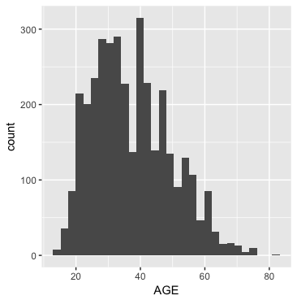
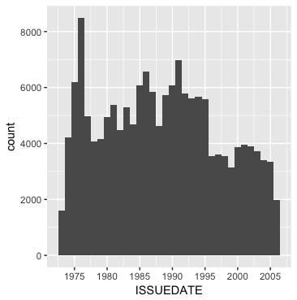
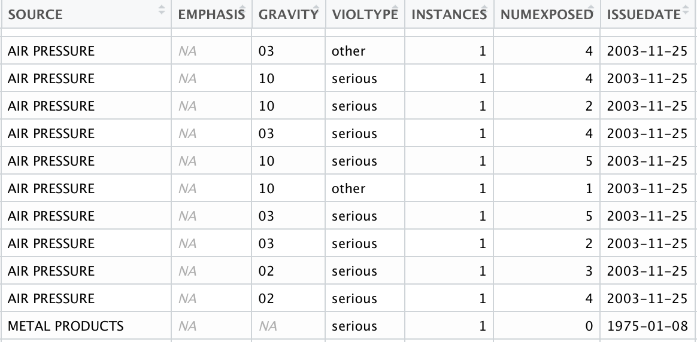
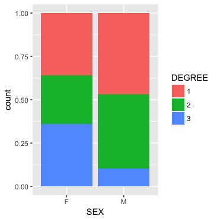
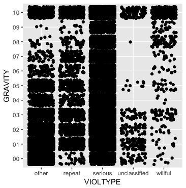

```{r setup, include=FALSE}
knitr::opts_chunk$set(echo = TRUE)
library(knitr)
opts_chunk$set(tidy.opts=list(width.cutoff=60),tidy=TRUE)
```

This project involved preparing and cleaning up data from OSHA about workplace accidents and safety violations in the state of Massachusetts over the course of over 20 years. Although the data came with much more information, I retained only the variables that I felt could contribute to relevant, significant analysis on safety within the workplace, and modified the layouts of several variables to make analysis easier and clearer. The final product was two data sets, "all" and "all_noDUPL", and the difference between the two is explained later in the report.

To set up the project, I initialize several packages. The working directory is already set by the project file.
```{r, eval=FALSE}

require(foreign)
require(dplyr)
require(tidyr)
require(lubridate)
require(ggplot2)
```

#Accidents

The accidents database had the most variables that provided significant information on the safety of the workplace, so I was mainly concerned with repetitive variables and making sure all missing data was represented with NA. Upon first glance, the RELINSP variable seemed to be a duplicate of ACTIVITYNO, so I checked to see if there were any entries for which RELINSP did not equal ACTIVITYNO, and since there were none, I deleted the column. OCC_CODE and HAZSUB did not seem to provide relevant information either, and SITESTATE was unneccessary since all of the data was from Massachusetts (though I first double-checked to see if there were any non-MA entries), so I removed them as well. The remaining variables seemed potentially useful, so I left them alone.

```{r, eval=FALSE}
a <- read.dbf("accid.dbf")

a$RELINSP[a$RELINSP != a$ACTIVITYNO]
a <- select(a, -RELINSP)

a <- select(a, -OCC_CODE)

length(a[a$SITESTATE != 'MA']) 
a <- select(a, -SITESTATE, -HAZSUB)
```

Several of the variables, especially those containing identification codes, labeled missing data as "00", "99", etc. There were no codes corresponding to any number consisting of all 0's, and it was extremely unlikely that there was a 99 year old worker employed in any of these companies, so I replaced such values with NA. 

```{r, eval=FALSE}
a$AGE[a$AGE == 0] <- NA
a$DEGREE[a$DEGREE == 0] <- NA
levels(a$NATURE)[levels(a$NATURE) == "00"] <- NA
levels(a$BODYPART)[levels(a$BODYPART) == "00"] <- NA
levels(a$SOURCE)[levels(a$SOURCE) == "00"] <- NA
levels(a$EVENT)[levels(a$EVENT) == "00"] <- NA
levels(a$ENVIRON)[levels(a$ENVIRON) == "00"] <- NA
levels(a$HUMAN)[levels(a$HUMAN) == "00"] <- NA
a$AGE[a$AGE == 99] <- NA
a$TASK[a$TASK == 0] <- NA
```

Next, I replaced the numeric codes with their verbal counterparts to make the data easier to immediately understand. The definitions for each code were stored in the accidents lookup, but since all categories of codes 
were contained in the same table, I had to split the table into their categorical counterparts by indexing, and then replace the names of the "CATEGORY" column in each table with its corresponding category name in the accidents database, so that I could eventually join each table to its corresponding column in the accidents database.

```{r, eval=FALSE}
aFac <- read.dbf("lookups/acc.dbf") 
aFac <- aFac[-1]

partbody <- aFac[1:31,]
envirfac <- aFac[32:49,]
eventtyp <- aFac[50:63,]
humanfac <- aFac[64:83,]
naturinj <- aFac[84:105,]
sourcinj <- aFac[106:153,]

colnames(partbody)[1] <- 'BODYPART' 
colnames(envirfac)[1] <- 'ENVIRON'
colnames(eventtyp)[1] <- 'EVENT'
colnames(humanfac)[1] <- 'HUMAN'
colnames(naturinj)[1] <- 'NATURE'
colnames(sourcinj)[1] <- 'SOURCE'
```
After left-joining the category columns to the table, I deleted the original columns containing the numeric codes, and renamed each category column to the name of the deleted column.

```{r, eval=FALSE}
a <- left_join(a, partbody, by = 'BODYPART')
a <- select(a, -BODYPART)
colnames(a)[colnames(a) == 'VALUE'] <- 'BODYPART'

a <- left_join(a, envirfac, by = 'ENVIRON')
a <- select(a, -ENVIRON)
colnames(a)[colnames(a) == 'VALUE'] <- 'ENVIRON'

a <- left_join(a, eventtyp, by = 'EVENT')
a <- select(a, -EVENT)
colnames(a)[colnames(a) == 'VALUE'] <- 'EVENT'

a <- left_join(a, humanfac, by = 'HUMAN')
a <- select(a, -HUMAN)
colnames(a)[colnames(a) == 'VALUE'] <- 'HUMAN'

a <- left_join(a, naturinj, by = 'NATURE')
a <- select(a, -NATURE)
colnames(a)[colnames(a) == 'VALUE'] <- 'NATURE'

a <- left_join(a, sourcinj, by = 'SOURCE')
a <- select(a, -SOURCE)
colnames(a)[colnames(a) == 'VALUE'] <- 'SOURCE'
```

Finally, I used the unique function to make sure that all accident cases only appeared once.
```{r, eval=FALSE}
a <- unique(a)
```

#Violations

Most of the variables in the violations database were irrelevant to worker safety and/or were only used for identification purposes, so I eliminated all but a few. 

```{r, eval=FALSE}
v <- read.dbf("viol.dbf")
v <- select(v, -SITESTATE, -ISSUANCE, -ITEMGROUP, -PENCURRENT, -PENINITIAL, -VIOLTYPEA, -STD, -STD_LOOKUP, -ABATE, -ABATEDT,
            -ABATEDT2, -ABATEDONE, -ERCONTDT, -ERCONDATE, -PENCONT, -EMPRCONT, -EMPECONT, -FINORDT,
            -FINORDATE, -AMENDED, -ISA, -DISPEVT, -HAZCAT, -FTAINSP, -FTAPEN, -ISSUDT, -FTA_ISDT, -CONTDT, -CONTDATE, -FTA_AMN,
            -FTA_ISA, -FTA_DISP, -FTA_FIN, -FTAFINDT, -ITEMNO, -REC, -VIOLCONT, -PMA, -CITATION -DATE_ABATE)

```

The DELETE column was supposed to indicate if there were any violations that were deleted, so I checked to see if there were any that were marked. There were none, so I proceeded to delete that column.

```{r, eval=FALSE}
v <- v[is.na(v$DELETE),]
v <- select(v, -DELETE)
```

Finally, I replaced violation codes, which were single letters, with the full word that they represent, again to make analysis easier to understand.

```{r, eval=FALSE}
levels(v$VIOLTYPE)[levels(v$VIOLTYPE) == 'S'] <- 'serious'
levels(v$VIOLTYPE)[levels(v$VIOLTYPE) == 'O'] <- 'other'
levels(v$VIOLTYPE)[levels(v$VIOLTYPE) == 'R'] <- 'repeat'
levels(v$VIOLTYPE)[levels(v$VIOLTYPE) == 'U'] <- 'unclassified'
levels(v$VIOLTYPE)[levels(v$VIOLTYPE) == 'W'] <- 'willful'
```

# OSHA

The CONTFLAG variable of the OSHA database was supposed to indicate if a record continued onto the next entry,so I first checked to see if the continuation applied to any entries, and then inspected the entries to which it did apply. Out of the two continuing cases that had a mark in CONTFLAG, neither of them had a second entry that added any new information, so I deleted the duplicate entries. I then proceeded to again select only the varialbes that I deemed could be helpful in analysis.

```{r, eval=FALSE}
o <- read.dbf("osha.dbf")

(o$CONTFLAG[!is.na(o$CONTFLAG)]) 
o[which((!is.na(o$CONTFLAG))),] 
o <- o[-69721,]
(o$EMPCOUNT[o$EMPCOUNT != 0]) 
(o$EMPCOVERED[o$EMPCOVERED != 0])

o <- select(o, ACTIVITYNO, WALKAROUND, INTRVIEWD, WHYNOINSP, CLOSECASE, SITECNTY)
```

#Joining the data

Next, I full joined all of the modified datasets. I was not concerned about duplicate data at this point, for I would eliminate duplicates later.

```{r, eval=FALSE}
all <- full_join(a, v, by = "ACTIVITYNO")
all <- full_join(all, o, by = "ACTIVITYNO")
```

To get a preliminary look at the joined data, I plotted the distributions of some of the variables, such as age (Figure 1) and date (Figure 2), to see if there were any strange incidences. There did not seem to be any outliers or suspicious features in the graphs, so the graphics did not present to me any new ideas for cleaning the joined data.
```{r, eval=FALSE}
ggplot(data=all, aes(x=AGE)) + geom_histogram()
ggplot(data=all, aes(x=ISSUEDATE)) + geom_histogram(binwidth = 365)
```


  


I then used a loop to go through each column and see if there were any more variables with a NA for every entry and then delete such columns, and then another loop to check if there were any columns that had less than 30 entries and then delete such columns, since those would not be able to produce any significant analysis. Luckily, there were none such columns.

```{r, eval=FALSE}
for(colnum in 1:length(all)){
  allna <- TRUE
  for(i in 1:nrow(all[colnum])){ 
    if(!is.na(all[i, colnum])){
      allna <- FALSE
      break}}
  if(allna == FALSE){ # allna = FALSE means there is at least one entry in that column that is not NA
    break}
  else{
    all <- all[-colnum]}
}

for(colnum in 1:length(all)){
  count = 0
  for(i in 1:nrow(all[colnum])){ 
    if(!is.na(all[i, colnum])){
      count <- sum(1, count)}}
  if(count >= 30){
    break}
  else{
    all <- all[-colnum]}
}
```

Afterwards, I read the Massachusetts county codes in the SCC database and joined them to the county codes in my data to replace the numeric codes with the county names, similarly to how I replaced the accident codes with their verbal equivalents.

```{r, eval=FALSE}
scc <- read.dbf("lookups/scc.dbf")
mascc <- filter(scc, STATE=="MA")
mascc <- select(mascc, -TYPE, -STATE, -CITY)
colnames(mascc) <- c('SITECNTY', 'COUNTY')
mascc <- mascc[1:15,]

# join county names to "all"
all <- left_join(all, mascc, by = 'SITECNTY')
all <- select(all, -SITECNTY)
```

I converted the date columns to date format and converted activity number to a factor vector, since it was previously numeric, and then arranged the data by activity number so it was easier to see which cases still had duplicate entries. Finally, I used the 'unique' function to eliminate any entries that were exactly identical.

```{r, eval=FALSE}
all$ISSUEDATE <- as.Date(all$ISSUEDATE)
all$ACTIVITYNO <- as.factor(all$ACTIVITYNO)
arrange(all, ACTIVITYNO)
all <- unique(all)
```

#Compensating for Remaining Duplicate Data



After cleaning and joining the data, I realized that there were several rows with the same activity number that had completely identical data except for the values of several variables, and realized that this presents an issue because repeated activity numbers would be counted multiple times in analysis. For instance, one of these columns was the NUMEXPOSED column, which came from the violations data and indicates the number of people exposed to the violation. Several cases had multiple rows with different values under the NUMEXPOSED column, but all the accident data for these rows were the same, implying that all of these rows correspond to the same incident. (For example, in the partial table in Figure 3, all of the rows shown belong to the same activity number, but values for several violation variables vary for each row.) The README file that came with the data claims that "When they create files for public use, they are forced to split large records into several records. The problem occurs when an inspection has more violations than one record can contain. In this case, they will begin a new record with the same unique identifying number. All of the inspection information will be the same, what you will notice is different is the violation information included." Since it is important to preserve all violation records of each incident, but it is also extremely important to not double-count any one incident when analyzing non-violation data, I made another dataset "all_noDUPL" that counts each activity number only once, so this dataset should be used when analyzing variables that do not have multiple values for any one activity number. In other words, because the "all" dataset contains cases with duplicate accident data, "all" should only be used to analyze within the following variables, which I will refer to as **"duplicable variables"**: EMPHASIS, GRAVITY, VIOLTYPE, INSTANCES, NUMEXPOSED. These variables have different values for the same activity number depending on the violation that it is referring to. Analysis among all other variables should use the **"all_noDUPL"** dataset. When plotting duplicable variables against non-duplicable variables using the "all" dataset, one must be aware that each activity number with multiple violations is getting counted as many times as it has violations.

```{r, eval=FALSE}
all_noDUPL <- all[!duplicated(all$ACTIVITYNO),]
```

#Graphics with "all" and "all_noDUPL"

Figure 4: I used the dataset "all_noDUPL"" to display the discrepancies, for each sex, between the proportions of degrees of injury. 1st degree means fatality, 2nd degree means a hospitalized injury, and 3rd degree means a non-hospitalized injury. There is a much larger proportion of males that died as a result of a workplace accident, and a much larger proportion of females that did not require hospitalization. Because this bar graph compares the degrees by proportion, it does not take into account that there were significantly many more males than females in the data.

```{r, eval=FALSE}
ggplot(data=subset(all_noDUPL, !is.na(all_noDUPL$SEX)), aes(x=SEX, fill=DEGREE)) + geom_bar(position='fill') 
```



Figure 5: For this graphic, I used the dataset "all" to compare pairs of violation type and gravity (the level of potential harm to workers). Because one activity number can have multiple entries in both of these variables, each activity number can have multiple corresponding points on this jitter plot, so this plot focuses less on singular incidents and more on how violation type relates to the gravity of the violation in general. This graphic reveals several interesting relationships: for instance, the lower the gravity, the higher the frequency of "other" violations EXCEPT for violations with level 10 gravity, which are very frequent. For willful violations, the higher the gravity, the more the violations. There is a general high frequency of level 10 gravity violations in all of the columns, which calls into question whether level 10 gravity could have been used for something other than its indicated purpose. However, there is no way to tell with the information and data given, so I left it as is.


```{r, eval=FALSE}
ggplot(data=subset(all, !is.na(VIOLTYPE)&!is.na(GRAVITY)), aes(x=VIOLTYPE, y=GRAVITY)) + geom_jitter()
```



